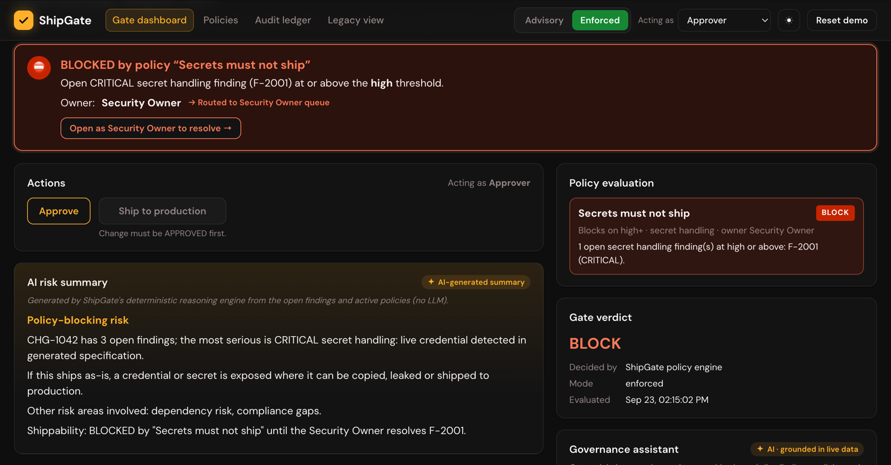

# ShipGate

## [Try to ship the flagged change yourself →](https://shipgate-12wg.onrender.com/#/changes/CHG-1042)

**A security scanner flags a live credential in a change. The approver clicks Approve anyway, because in the old process findings are "informational". ShipGate refuses the approval, cites the policy, routes the change to the Security Owner, and writes every step to a tamper-evident ledger.**

**Live:** [app](https://shipgate-12wg.onrender.com) · [CHG-1042](https://shipgate-12wg.onrender.com/#/changes/CHG-1042) · [legacy view](https://shipgate-12wg.onrender.com/#/legacy) · [audit ledger](https://shipgate-12wg.onrender.com/#/ledger) · [architecture model](https://devpath56.github.io/ShipGate/) — no login, nothing to install. The free host sleeps when idle; the first load can take up to 50 seconds.

**Specified in Opsera Forge, built from its work orders.** Forge's spec-first pipeline produced the intent, PRD, architecture and 29 work orders (WO-001 to WO-029); the code implements them, and this repository is linked and synced in the project's Forge Application Context, and the work orders are tracked on its board. **[The Forge trail →](docs/forge/)**: every stage's artifact, what we fed Forge at each gate, and which file implements each work order. The app is hosted on Render, which the Opsera team confirmed is acceptable for this hackathon.

**Result:** flagged change reaching production **shipped → refused**, advisory → enforced · no bypass found in an adversarial audit · 24 tests



## The problem

Production changes are approved by a change advisory board: an email thread, a PDF of scanner output, and a weekly call where fourteen people approve thirty changes in a batch. A security finding is "informational", so a change carrying a live credential ships as soon as one person replies *"LGTM, approved"*.

AI-generated code makes this worse, not better. Forge's own security agents inspect every artifact, but its docs are explicit: *"Findings are informational — they do not block pipeline progression."* The scanner does its job. The process ships the change anyway.

## What it does

1. **Evaluate.** Every change's open findings are checked against active blocking policies, giving an ALLOW or BLOCK verdict that names the policy and the findings.
2. **Enforce.** In enforced mode the server refuses any approval or shipment that a policy blocks. The check sits in the state transitions, not the UI, so a direct API call is refused too.
3. **Route.** A refused change moves to BLOCKED and lands in the policy owner's queue. Only that role can resolve the finding, and only with a written note. The gate then re-evaluates and the change can ship.
4. **Record.** Every transition, refusals included, is appended to a SHA-256 hash-chained ledger. **Verify chain** recomputes it and reports the first broken or missing event.
5. **Explain.** A risk summary, a plain-language explanation and fix for each finding, a governance assistant, and a suggested policy, all generated from the live findings, policies and ledger.

An **Advisory / Enforced** toggle runs the same change through the legacy process and through ShipGate, side by side.

## Result

| Scenario | Advisory mode (legacy) | Enforced mode (ShipGate) |
|---|---|---|
| Approver approves CHG-1042 (open CRITICAL secret-handling finding) | **Approved and shipped** | **Refused** (409), BLOCKED, routed to Security Owner |
| Approve in advisory, switch to enforced, then ship | — | **Refused at ship time** |
| Security Owner resolves with a note, then re-approve | — | Shipped. Ledger reads BLOCKED → RESOLVED → APPROVED → SHIPPED |
| Judge / Guest role calls the approve API directly | Refused (403) | Refused (403) |
| Resolve with an empty note | Refused (400) | Refused (400) |
| An event is edited, or the newest event deleted | — | Verify chain reports the broken or missing event |

**The findings feed is simulated, and labelled so in the UI.** The blocking is ShipGate's own logic, not native Forge behaviour. The AI layer is a deterministic reasoning engine over live data, with no LLM: it gives the same answer every time and declines questions outside governance. In production the feed would be a live adapter over Forge's MCP endpoint.

`npm test` runs the checks above plus tamper, reset and assistant cases: 24 tests, no network, no keys.

## Run locally

Needs Node 20+.

```bash
git clone https://github.com/devpath56/ShipGate && cd ShipGate
npm install
npm test                              # 24 tests, no internet, no keys
npm run build && npm start            # app and API on :8787
```

**Walk the demo:** Legacy view → CHG-1042 → Approve → Ship (it ships) → **Reset demo** → **Enforced** → Approve (refused) → *Open as Security Owner to resolve* → note → Resolve → switch to Approver → Approve → Ship → **Verify chain**.

## Architecture model

The architecture is a versioned model, drawn and checked by [Drawing Office](https://github.com/devpath56/drawing-office) and transcribed from Forge's generated architecture artifact, not invented.

| View | Kind | Shows |
|---|---|---|
| Context | system context | four demo roles, ShipGate, and Opsera Forge, which generated the spec |
| Containers | container | the web app owns no state; the API server owns all of it |
| Screens | component | the app shell, five screens, and the one API client they share |
| Engine | component | routes decide nothing, the governance engine decides, the ledger records both, the AI layer explains |
| **Advisory** | feature trace | baseline: CHG-1042 ships despite its open CRITICAL finding |
| **Enforced** | feature trace | the identical approval is refused, cited, routed to Security Owner, and recorded |
| **Resolve** | feature trace | Security Owner resolves with a note; re-approve ships; BLOCKED → RESOLVED → SHIPPED |
| **Explain** | feature trace | the assistant answers "why is CHG-1042 blocked?" from the live finding, policy and ledger |
| Demo | deployment | one process on Render; the SPA runs in the browser |

Ten decisions sit in `architecture/shipgate/adrs/`. Each accepted one names the code that implements it; decision 8 (Forge Shipping to ECS) is superseded by decision 9 (Render).

**The model follows the code.** Every component names its source files in a `"code"` property, and `architecture/drift.mjs` compares the two on every push that touches `server/`, `web/src/` or `architecture/`: it reports a source file no component names (`unclaimed`), a component naming a file that no longer exists (`missing`), and an import the model draws no line for (`unwired`).

**Live:** https://devpath56.github.io/ShipGate/ — rebuilt by `.github/workflows/architecture.yml`. A pull request runs the drift check, the build and all 17 Drawing Office checks without deploying, so a model that has fallen behind the code, or that Drawing Office would refuse, fails the PR.

```bash
node architecture/drift.mjs                          # model vs code
node ../drawing-office/tools/build.mjs --root .      # needs structurizr-cli + Graphviz
node ../drawing-office/tools/serve.mjs 8019 --root . # then open /architecture/viewer.html
```

## Repo map

```
server/        Fastify API: owns all state, policy gates, transitions, hash ledger, AI layer, tests
web/           React SPA: owns no state; dashboard, change detail, policies, ledger, legacy view
architecture/  Drawing Office model of the architecture, ten ADRs, and the model-vs-code drift check
demo/          the demo deck: non-app beats as HTML, D2 workflow diagrams, and sourced screenshots
docs/          the Forge trail (docs/forge: intent, PRD, architecture, 29 work orders, testing) and screenshots
render.yaml    single-process deploy (in-memory state needs one long-running instance)
```

Built during SF Enterprise Hackathon 2.0 (Legacy Modernization track) by Isha Mishra and Devansh Pathak, with Opsera Forge and Claude Code. The visual style uses Forge's own design tokens so ShipGate reads as part of the Forge workflow. It is an independent project, not an Opsera product.
