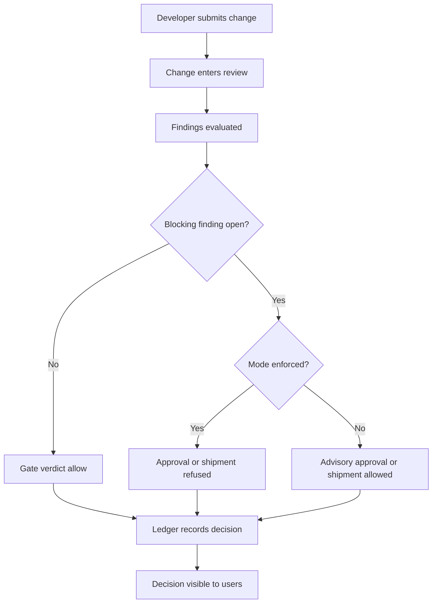
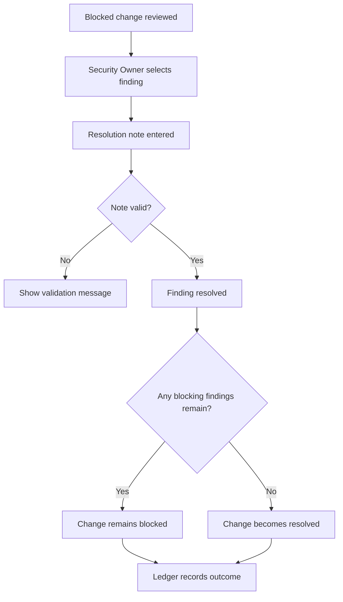
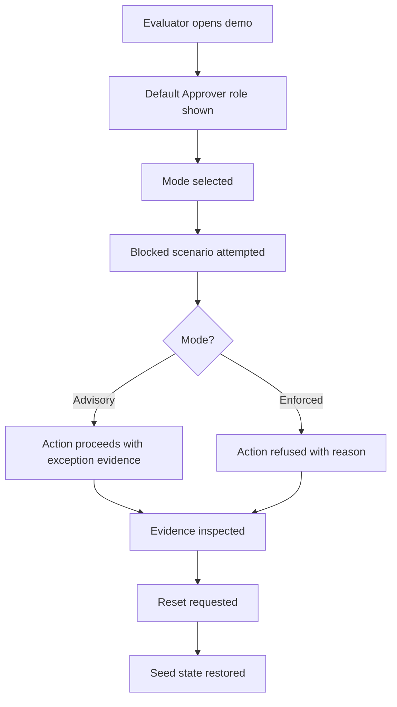
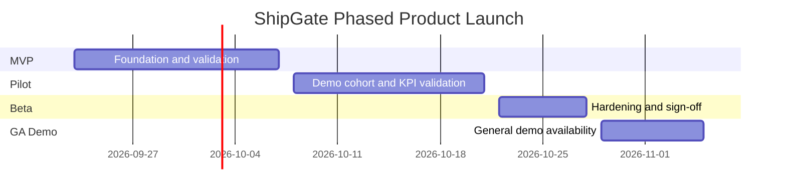

## Executive Summary

ShipGate will be a focused release-governance web application designed to make production change decisions deterministic, transparent, and auditable. The product opportunity is to provide teams with a clear, severity-aware approval experience where findings are evaluated consistently against blocking policies, decision rationale is visible to all participants, and every approval, refusal, resolution, shipment, and reset is captured in a tamper-evident audit trail.

The initial release will deliver an end-to-end demo-ready product: a seeded change queue, severity-coded findings, policy-driven gate verdicts, role-based demo controls, advisory versus enforced operating modes, a policy list, a modern change detail experience, and a deliberately distinct Legacy View that illustrates why deterministic governance matters. The system will be fully usable without login and clearly marked as a demo/non-production experience while still requiring backend-owned enforcement for state changes.

The primary beneficiaries are developers, approvers, security owners, and evaluators who need to understand whether a change is safe to approve or ship. The key value proposition is policy enforcement accuracy: blocking findings at or above the configured threshold cannot be overridden incorrectly in enforced mode, and every decision remains explainable through visible gate verdicts and ledger history.

---

## Business Objectives and Success Criteria

| Objective | How System Delivers | Success Criteria | Measurement Method |
|-----------|--------------------|-----------------|--------------------|
| Maximize policy enforcement accuracy for blocking findings | ShipGate evaluates every change against active severity thresholds and prevents approval or shipment in enforced mode when open findings meet or exceed the active threshold. | 100% of enforced-mode attempts to approve or ship a change with an open high or critical finding are refused during acceptance testing. | Test suite results plus manual demo validation using the seeded blocked change scenario. |
| Make release decisions understandable to evaluators | The dashboard groups changes by gate verdict, and the detail screen presents findings, policy evaluation, verdict rationale, and ledger history in one experience. | 90% of pilot evaluators can identify why CHG-1042 is blocked within 60 seconds without facilitator help. | Timed pilot task observation and evaluator survey. |
| Demonstrate auditability for every decision | Every successful or refused transition produces a visible ledger entry that includes actor, state movement, timestamp, note when applicable, and prior-link evidence. | 100% of transition attempts in pilot scenarios produce a visible ledger entry within 1 second of completion. | Scenario checklist comparing user actions to visible ledger entries. |
| Support a frictionless demo experience | The application will require no login, default to the Approver role, and provide visible demo role and enforcement-mode controls. | 95% of pilot users can begin interacting with the dashboard within 10 seconds of first page load. | Browser-based pilot observation and client performance timing. |
| Reduce ambiguity between advisory and enforced governance | The mode control will visibly distinguish advisory behavior from enforced blocking behavior and record advisory shipments with open critical findings. | 100% of pilot participants can correctly describe the difference between advisory and enforced mode after completing the guided scenario. | Post-demo comprehension check with five-question survey. |

---

## Personas and Stakeholders

| Name | Type | Role | Goals | Pain Points | How Served |
|------|------|------|-------|-------------|------------|
| Developer | Persona | Submits changes and monitors governance status | Understand whether a submitted change is eligible, blocked, or awaiting resolution. | Ambiguous approval signals; unclear remediation expectations. | Sees each change state, gate verdict, findings summary, and ledger history from the dashboard and detail views. |
| Approver | Persona | Reviews, approves, and ships eligible changes | Approve safe changes confidently and avoid approving policy-violating changes in enforced mode. | Manual interpretation of security findings; risk of rubber-stamping. | Receives clear allow/block verdicts, visible rationale, and disabled or refused actions when policy blocks apply. |
| Security Owner | Persona | Reviews and resolves security findings | Resolve blocking findings with documented rationale and maintain accountability. | Missing justification trails; unclear ownership of blocking findings. | Can resolve findings only with a note and sees unresolved blocking items routed to the policy owner role. |
| Judge / Guest | Persona | Evaluates the demo experience without login | Inspect product behavior, compare advisory and enforced modes, and view governance evidence. | Friction from authentication; difficulty seeing the product value quickly. | Gets unauthenticated access, role switching, view-only Judge-Guest mode, dashboard, detail, policy list, legacy view, and ledger visibility. |
| Product Sponsor | Stakeholder | Funds and prioritizes the product | Validate that ShipGate demonstrates deterministic release governance value. | Risk that the demo does not clearly show business differentiation. | Receives measurable pilot success criteria, a phased rollout plan, and demo flows aligned to the core outcome. |
| Compliance / Audit Reviewer | Stakeholder | Assesses auditability and control evidence | Confirm that change decisions are traceable and tamper-evident for SOC 2-oriented control narratives. | Incomplete or mutable decision records; lack of refusal evidence. | Reviews append-only ledger behavior, decision rationale, actor attribution, and retention expectations. |
| Engineering Team | Stakeholder | Builds and operates the demo product | Deliver a maintainable, testable application with clear ownership boundaries. | Frontend policy bypass risk; unclear state transition ownership. | Receives explicit backend-owned enforcement requirements, validation rules, NFRs, and acceptance criteria. |

---

## User Stories and Acceptance Criteria

| ID | As a... | I want to... | So that... | Priority | Acceptance Criteria |
|----|---------|-------------|-----------|----------|---------------------|
| US-001 | Developer | submit a draft change into review | the change can enter the governance queue for evaluation | P0 | Given a seeded change in DRAFT and the selected role is Developer, when I submit the change, then the system transitions it to IN_REVIEW and appends a hash-chained ledger event. Given the selected role is not Developer, when I attempt the same action, then the system prevents the action and records no successful state transition. |
| US-002 | Approver | approve an eligible change | safe changes can progress only when policy allows | P0 | Given a change has no open finding at or above the active blocking threshold and the selected role is Approver, when I approve the change in enforced mode, then the change transitions to APPROVED, the gate verdict remains allow, and a ledger event is appended. |
| US-003 | Approver | be blocked from approving a policy-violating change in enforced mode | blocking findings cannot be overridden incorrectly | P0 | Given CHG-1042 is IN_REVIEW with an open critical secret-handling finding, when an Approver attempts approval in enforced mode, then the transition is refused, the change moves to BLOCKED, the refusal reason is visible, and a hash-chained ledger event records the attempted action, actor, reason, timestamp, optional note, and previous hash reference. |
| US-004 | Approver | ship only eligible approved changes | production shipment follows the same policy gate as approval | P0 | Given a change is APPROVED and has no open finding at or above threshold, when an Approver ships it, then the change transitions to SHIPPED and the ledger records the shipment. Given a blocking finding remains open, when shipment is attempted in enforced mode, then the system refuses shipment and records the refused attempt. |
| US-005 | Security Owner | resolve a finding with a required note | remediation has accountable evidence | P0 | Given the selected role is Security Owner and a finding is open, when I enter a non-empty resolution note and resolve it, then the finding becomes resolved and the ledger records the action. Given the note is empty or whitespace only, when I submit resolution, then the system rejects it with a clear validation message and leaves the finding open. |
| US-006 | Judge / Guest | inspect the dashboard, details, policy list, legacy view, and ledger without login | I can evaluate the product quickly and safely | P1 | Given the application loads for a new visitor, when the visitor opens the product, then no login is required, the default role is Approver, the header shows the role switcher and mode toggle, and Judge-Guest can view all demo evidence without state-changing actions. |
| US-007 | Evaluator | toggle between advisory and enforced mode | I can compare baseline advisory behavior with deterministic enforcement | P1 | Given the mode is advisory, when an Approver approves or ships a change with an open critical finding, then the action proceeds and the ledger clearly records shipment with an open critical finding in advisory mode. Given the mode is enforced, when the same action is attempted, then the transition is refused and recorded. |
| US-008 | Product user | view a grouped gate dashboard | I can understand the queue by allow versus block status | P1 | Given seeded changes exist, when I open the dashboard, then changes are grouped by allow and block verdict, each group shows exception counts, and each change shows ID, title, state, and severity summary. Given no changes are available after a reset failure or data issue, then the dashboard displays an empty state with recovery guidance. |
| US-009 | Product user | inspect a change detail screen | I can see findings, policy evaluation, verdict, and ledger history in one place | P1 | Given I select a change from the dashboard, when the detail screen opens, then it displays findings with severity badges, active policy evaluation, gate verdict details, and chronological ledger history. Given ledger integrity data is unavailable, then the screen shows a non-blocking warning and does not imply the ledger is verified. |
| US-010 | Product user | reset the demo to its original state | repeated demonstrations start from deterministic seed data | P1 | Given demo data has changed, when reset is triggered, then all changes, findings, policies, gates, ledger events, and mode return to the original seeded state and advisory mode. Given reset fails, then the user receives a clear error and the prior visible state is preserved. |
| US-011 | Product user | view active policies | I can understand which governance rules drive gate decisions | P2 | Given at least one active policy exists, when I open the policy list, then policy name, description, blocking threshold, and owner role are shown. Given no active policy is present, then the screen displays an empty state explaining that no blocking policy is active. |
| US-012 | Evaluator | view a legacy-style approval mock | I can understand the business contrast the product is demonstrating | P2 | Given I open Legacy View, when the page renders, then it is clearly labeled as a legacy-style mock, shows CHG-1042 with its critical secret-handling finding, includes email-thread and meeting-note styling, and includes an approval message substantially similar to LGTM, approved — findings are informational. |

---

## Business Process Overview

### 1. Change Review and Gate Decision

This process enables a submitted change to be evaluated against active governance rules before approval or shipment. Its business purpose is to make the allow/block decision visible, consistent, and evidence-backed for every participant.

**Trigger event:** A Developer submits a draft change for review, or an Approver evaluates an in-review change.

| Step | Participants | Inputs | Outputs | Decision / Exception Path |
|------|--------------|--------|---------|---------------------------|
| 1. Submit change for review | Developer | Draft change details and selected demo role | Change enters review queue | If role is not permitted, the action is unavailable or refused with explanatory feedback. |
| 2. Evaluate findings | System, Approver | Open findings, severity levels, active policy threshold | Gate recommendation | If evaluation cannot complete, the product shows degraded decision feedback and avoids claiming a verified allow decision. |
| 3. Determine verdict | System | Severity comparison and finding status | Allow or block verdict | If an open high or critical finding exists under the seeded policy, enforced mode blocks approval and shipment. |
| 4. Approver acts | Approver | Verdict, rationale, selected enforcement mode | Approved state, blocked state, or advisory approval | Advisory mode may proceed while clearly recording the policy exception; enforced mode refuses blocked transitions. |
| 5. Ledger records decision | System | Actor, state movement, decision reason, timestamp | Visible audit timeline entry | If the action is refused, the refusal is still recorded as decision evidence. |

**Business outcome achieved:** Every change decision becomes explainable and auditable, and enforced mode prevents incorrect override of blocking findings.

### 2. Finding Resolution and Return to Eligibility

This process enables a Security Owner to resolve blocking findings with documented rationale. Its business purpose is to convert a blocked change into an eligible change only when the underlying blocking findings have been addressed.

**Trigger event:** A change is blocked because one or more open findings meet or exceed the active blocking threshold.

| Step | Participants | Inputs | Outputs | Decision / Exception Path |
|------|--------------|--------|---------|---------------------------|
| 1. Review blocked change | Security Owner | Blocked change, finding list, policy owner role | Prioritized remediation view | If no blocking findings are present, the user is guided back to the current change status. |
| 2. Enter resolution note | Security Owner | Resolution rationale | Submitted resolution evidence | Empty or whitespace-only notes are rejected with a clear message. |
| 3. Resolve finding | Security Owner, System | Finding status and note | Finding marked resolved | If role is not Security Owner, the action is unavailable or refused. |
| 4. Re-evaluate gate | System | Remaining open findings and policy threshold | Updated eligibility status | If any blocking finding remains open, the change stays blocked. |
| 5. Update audit trail | System | Actor, note, timestamp, state impact | Visible ledger history | If resolution fails, prior finding state is preserved and user receives recovery guidance. |

**Business outcome achieved:** Blocked changes become eligible only through accountable security-owner action with documented remediation evidence.

### 3. Demo Mode Comparison and Reset

This process supports evaluators who need to compare advisory behavior with enforced governance and repeat the same scenario reliably. Its business purpose is to make the product value demonstrable in a controlled, repeatable pilot setting.

**Trigger event:** A Judge/Guest or presenter changes the visible mode control or triggers reset before or during a demo.

| Step | Participants | Inputs | Outputs | Decision / Exception Path |
|------|--------------|--------|---------|---------------------------|
| 1. Select role and mode | Evaluator, Approver, System | Selected role and advisory/enforced mode | Updated demo context | Judge-Guest can inspect but cannot perform state-changing actions. |
| 2. Run blocked-change scenario | Approver, System | CHG-1042 and open critical finding | Advisory or enforced decision behavior | Advisory mode proceeds with explicit exception evidence; enforced mode refuses blocked transitions. |
| 3. Inspect evidence | Evaluator | Dashboard, detail panels, ledger timeline, policy list | Understanding of decision rationale | If data is unavailable, the product shows empty or error states with guidance. |
| 4. Reset demo | Presenter or permitted user | Reset command | Original seeded demo state and advisory mode | If reset fails, previous state remains visible and the user receives a clear error. |

**Business outcome achieved:** Stakeholders can repeatedly demonstrate and validate the product’s enforcement value without setup friction.

---

## Business Rules and Policies

| Rule | When It Applies | User Experience | Example |
|------|----------------|-----------------|---------|
| Severity threshold blocking | A change has an open finding at or above an active policy threshold while enforced mode is selected. The system must refuse approval or shipment and record the refused attempt. Exception: advisory mode may proceed but must visibly record the exception. | The user sees a clear block reason and the decision appears in the ledger. | CHG-1042 has an open critical secret-handling finding; enforced mode refuses approval, while advisory mode records the exception if the action proceeds. |
| Required resolution rationale | A Security Owner resolves any open finding. The system must require a non-empty note and reject blank or whitespace-only notes. Exception: view-only users cannot attempt the action. | The resolution form explains that a note is required and preserves the finding if validation fails. | A Security Owner enters a remediation note before resolving a secret-handling finding; an empty note shows validation feedback. |
| Demo role action limits | A user selects Developer, Approver, Security Owner, or Judge-Guest. The selected role determines which actions are available and which actor label appears in decision evidence. Exception: this is not real authentication and must be clearly labeled as a demo control. | Users see only relevant actions or disabled actions with explanatory text. | Judge-Guest can inspect the dashboard and ledger but cannot approve, ship, submit, or resolve. |
| Advisory versus enforced mode clarity | A user changes operating mode or attempts a blocked transition. The product must visibly distinguish advisory behavior from enforced blocking. Exception: reset returns the demo to advisory mode. | The header shows the current mode and any exception is explained in plain language. | Advisory mode allows shipment with an open critical finding and records that it shipped under advisory mode. |
| Deterministic seed data | The demo is started or reset. The system must restore the same eight changes, stable identifiers, seeded findings, seeded policy, gates, and ledger state. Exception: if reset fails, existing visible state is preserved and an error is shown. | Presenters can repeat the same scenario reliably. | Reset restores CHG-1042 as Add vendor export API in review with the required critical finding. |
| Tamper-evident audit trail | Any successful or refused transition occurs. The system must append an audit entry linked to the prior event; entries are treated as append-only evidence. Exception: if audit recording fails, the product must not present the transition as successfully recorded. | Users see chronological decision evidence and refusal evidence in the ledger timeline. | A refused approval records attempted action, actor, reason, timestamp, optional note, and previous-link evidence. |
| Accessibility standard | Any user-facing screen or control is delivered. The product must meet WCAG 2.1 AA, including keyboard navigation, screen reader support, visible focus, and accessible contrast. Exception: no user-facing feature may be considered complete without accessibility validation. | Keyboard and assistive technology users can complete core demo flows. | Severity badges use both color and text, not color alone. |
| Input validation and safe display | A user supplies a note, action input, selected role, selected mode, or navigation selection. The system must validate values against allowed options and safely display all output. Exception: invalid input is rejected with actionable feedback. | Users receive clear correction guidance without seeing technical details. | A finding resolution note containing unsupported content is rejected or safely displayed without breaking the page. |
| SOC 2-oriented auditability | Governance actions, resets, and mode changes occur. The product must preserve actor, timestamp, resource, decision, and change details in immutable decision evidence. Exception: demo access remains unauthenticated and non-production, so actor identity is the selected demo role. | Audit reviewers can reconstruct what happened in the demo scenario. | A mode change and subsequent refused approval can be reviewed in the ledger timeline. |
| Data classification and retention | Seeded change data, findings, policies, and ledger evidence are displayed or stored in memory. The product must classify demo data and avoid real credentials or production PII. Exception: no durable production retention is required for MVP, but audit retention expectations must be documented for future productionization. | Users see demo-safe content and no secret values are exposed. | The seeded critical finding describes a detected live credential but must not include any actual credential value. |

---

## Success Metrics and KPIs

### Primary Metrics

| Metric | Target | Measurement Method | Timeline | Business Impact |
|--------|--------|--------------------|----------|----------------|
| Enforced-mode blocking accuracy | 100% of approval and shipment attempts with open high-or-critical findings are refused | Acceptance tests and pilot scenario checklist | MVP validation by 2026-10-07 | Prevents incorrect override of blocking findings. |
| Decision explainability | 90% of pilot evaluators identify the block reason for CHG-1042 within 60 seconds | Timed user task study | Pilot by 2026-10-14 | Demonstrates product value quickly to sponsors and judges. |
| Audit event completeness | 100% of successful and refused transition attempts produce visible ledger evidence | Scenario audit checklist | MVP validation by 2026-10-07 | Supports SOC 2-oriented control evidence and accountability. |

### Secondary Metrics

| Metric | Target | Measurement Method | Timeline | Business Impact |
|--------|--------|--------------------|----------|----------------|
| Demo time-to-first-action | 95% of users can take a permitted action or inspect a change within 10 seconds of page load | Pilot observation and browser timing | Pilot by 2026-10-14 | Reduces friction for evaluators and presenters. |
| Role permission clarity | 90% of pilot users correctly identify which role can submit, approve, ship, resolve, or view-only | Five-question post-demo survey | Pilot by 2026-10-14 | Reduces confusion created by demo role switching. |
| Reset reliability | 100% of reset attempts restore original seeded state and advisory mode in acceptance testing | Repeatable reset scenario test | MVP validation by 2026-10-07 | Enables reliable demonstrations and repeat testing. |
| Mobile usability | 100% of core screens render without horizontal scrolling at 375px viewport width | Responsive QA checklist | Beta by 2026-10-21 | Ensures accessibility for judges and stakeholders on varied devices. |

### Guardrail Metrics

| Metric | Target | Measurement Method | Timeline | Business Impact |
|--------|--------|--------------------|----------|----------------|
| User-facing error rate during pilot | Less than 1% of user actions result in unhandled or unclear errors | Pilot telemetry and issue log | Pilot through 2026-10-21 | Protects confidence in demo reliability. |
| Core interaction response time | 95th percentile user action feedback under 500 milliseconds for seeded demo flows | Browser and backend timing checks | MVP validation by 2026-10-07 | Keeps governance interactions fast and credible. |
| Accessibility conformance | 0 critical WCAG 2.1 AA violations before GA | Accessibility audit and keyboard testing | GA readiness by 2026-10-28 | Prevents exclusion and policy non-compliance. |
| Secret exposure | 0 actual credentials, tokens, or private keys displayed, logged, or seeded | Content review and security test checklist | All phases | Prevents unsafe demo content and reinforces trust. |

---

## Risks Assumptions Dependencies and Constraints

### Risks

| Risk | Probability | Business Impact | Trigger Conditions | Mitigation | Owner |
|------|------------|-----------------|-------------------|------------|-------|
| Demo users misunderstand role switcher as real authentication | Medium | Stakeholders may overestimate security maturity or misread demo boundaries. | Users see role-based actions without login. | Label role switcher and application as demo/non-production on all screens; include explanatory helper text. | Product Manager |
| Frontend bypass undermines enforcement story | Medium | Core value proposition fails if policy decisions can be bypassed outside the backend-owned transition path. | UI mutates state directly or omits backend validation. | Require backend-owned transition logic, negative tests for blocked transitions, and no direct frontend state mutation for governance outcomes. | Engineering Lead |
| Advisory mode creates confusion about product safety | Medium | Evaluators may think ShipGate allows unsafe releases by design. | Advisory shipment with open critical finding is shown without sufficient explanation. | Use explicit mode labels, warning copy, and ledger language that advisory is the baseline comparison and enforced is the safety target. | Product Manager |
| Seed data does not demonstrate enough variety | Low | Demo may feel narrow or fail to prove dashboard grouping and resolution flows. | Changes beyond CHG-1042 lack meaningful clean and low/medium examples. | Validate seed data against all screens and include clean, low, medium, blocked, resolved, approved, and shipped examples. | Product Designer |
| Accessibility issues reduce evaluator reach | Medium | Some users cannot complete core flows; policy requirements are missed. | Keyboard navigation, focus order, contrast, or screen reader labels fail testing. | Run WCAG 2.1 AA checklist before Beta and block GA on critical violations. | Design Lead |
| In-memory demo state is mistaken for production readiness | Low | Stakeholders may expect persistence, accounts, or durable audit retention in MVP. | Product is presented without scope framing. | State non-production demo constraints in onboarding and rollout materials. | Product Sponsor |

### Assumptions

| Assumption | Impact if Wrong | Validation Plan |
|-----------|----------------|----------------|
| [ASSUMPTION] Pilot users will accept unauthenticated demo access because the application is clearly marked non-production. | If false, stakeholders may require login or access controls before pilot, expanding scope. | Confirm with pilot sponsors before MVP demo and include this in onboarding notes. |
| [ASSUMPTION] React and TypeScript with a lightweight Node.js REST backend will satisfy demo delivery needs. | If false, stack selection may delay implementation or require architecture revision. | Engineering spike during MVP foundation phase. |
| [ASSUMPTION] SOC 2 is the only compliance framework in scope for initial release. | If false, HIPAA, PCI-DSS, GDPR, or SOX requirements could add privacy, retention, and control obligations. | Compliance owner confirms framework scope before Beta. |
| [ASSUMPTION] Seeded demo data is sufficient to validate product value without external CI/CD integration. | If false, stakeholders may request pipeline integration, increasing timeline and complexity. | Collect pilot feedback and track requests for external integrations as future considerations. |
| [ASSUMPTION] Quantitative KPI targets are acceptable as product launch targets because historical baselines are not available for a new product. | If false, sponsors may require baseline studies before success evaluation. | Review metrics with sponsor during Phase 1 planning. |

### Dependencies

| System/Team | Dependency | Timeline | Impact if Delayed |
|------------|-----------|----------|------------------|
| Product Management | Final confirmation of demo copy, KPI thresholds, and open-question owners | 2026-09-25 | Delays MVP acceptance criteria sign-off. |
| Engineering | Build backend-owned state engine, in-memory seed store, ledger integrity, and UI integration | 2026-10-07 | Blocks functional demo readiness. |
| Design | Responsive dashboard, detail view, policy list, legacy view, and accessibility review | 2026-10-07 | Reduces demo clarity and may block Beta. |
| Compliance / Audit Reviewer | SOC 2-oriented control review of ledger evidence and data handling | 2026-10-14 | Delays Beta sign-off and GA readiness. |
| Pilot Cohort | Evaluator availability for timed tasks and feedback | 2026-10-14 to 2026-10-21 | Delays KPI validation and rollout decision. |

### Constraints

| Constraint | Type | Impact |
|-----------|------|--------|
| Fully usable without login and clearly marked as demo/non-production | business | Speeds evaluation but limits claims about production identity assurance. |
| No durable persistence beyond in-memory seeded state for MVP | technical | Keeps scope small but prevents production retention claims. |
| Backend must own all transitions and policy enforcement | technical | Requires disciplined separation between UI presentation and governance decisions. |
| SOC 2 only for initial compliance scope | regulatory | Focuses auditability requirements while deferring broader regulatory obligations. |
| Reset must restore original seed data and advisory mode | business | Enables repeatable demos but requires deterministic seed design. |
| No external CI/CD, email, or notification integrations in initial release | resource | Keeps timeline feasible but limits real operational deployment workflows. |

---

## Scope NFRs and Open Questions

### In Scope

- Seeded release-governance demo experience for eight deterministic changes, including CHG-1041 through CHG-1048.
- Backend-owned state transitions for submit, approve, resolve finding, ship, reset, mode management, policy evaluation, and ledger updates.
- Advisory and enforced modes with a visible header control and backend-owned behavior.
- Stable seeded policy named Secrets must not ship, owned by Security Owner, blocking high-and-above findings.
- Gate Dashboard grouped by allow and block verdict with exception counts and severity summaries.
- Change Detail screen with findings list, policy evaluation, gate verdict, and hash-chain ledger timeline.
- Policy List screen showing active blocking policies, thresholds, descriptions, and owner roles.
- Legacy View mock showing CHG-1042 being rubber-stamped despite a critical secret-handling finding.
- Demo role switcher for Developer, Approver, Security Owner, and Judge-Guest view-only.
- Responsive, accessible UI for desktop and mobile.

### Out of Scope

- Real authentication, accounts, passwords, MFA, sessions, or production RBAC.
- Durable database persistence or production-grade audit storage.
- External CI/CD, deployment, ServiceNow, Slack, email, or notification integrations.
- User registration, profile management, or organization administration.
- Policy creation, arbitrary seed editing, or general CRUD beyond defined demo flows.
- Native mobile applications.
- Reporting or analytics dashboards beyond the gate dashboard.

### Future Consideration

- Production authentication and RBAC with real user identity.
- Durable append-only audit storage with retention automation.
- CI/CD and change-management tool integrations.
- Policy authoring, versioning, and approvals.
- Notification workflows for policy owners and approvers.
- Advanced governance analytics, trend reporting, and exportable audit reports.
- Localization and right-to-left layout support if ShipGate is expanded beyond the initial demo audience.

### Non-Functional Requirements

- **Performance:** Initial dashboard content should be interactive within 2 seconds on a standard broadband connection; core action feedback should complete within 500 milliseconds at the 95th percentile for seeded demo flows; reset should complete within 1 second for the seeded dataset.
- **Security:** No real login is in scope, but all state-changing actions must be enforced server-side according to selected demo role and mode. All user inputs, including notes, role values, mode values, and identifiers, must be allow-list validated. Output must be safely rendered and must never expose actual credentials, tokens, stack traces, or secrets.
- **Accessibility:** All user-facing screens must meet WCAG 2.1 AA, including keyboard navigation, visible focus states, semantic labels, screen reader support, and color contrast. Severity must be conveyed by text and iconography in addition to color.
- **Scalability:** MVP is optimized for demo-scale seeded data and at least 25 concurrent pilot users. Future productionization should revisit persistence, concurrent editing, retention, and operational telemetry.
- **Compliance:** Initial compliance scope is SOC 2 only. Ledger evidence must support control narratives for change approval, refusal, actor role, timestamp, decision rationale, and integrity linkage. Demo data must be classified as Internal demo data, with no production PII or real secrets.
- **Reliability and graceful degradation:** Loading, empty, error, and reset-failure states must be visible and actionable. The product must not present an unverified decision as verified if policy evaluation or ledger recording fails.
- **Internationalization:** Initial MVP will use English-only copy and locale-aware timestamps. Multi-language translation and right-to-left layout are future considerations unless stakeholders expand the target audience.

### Open Questions

1. Who will be the named business owner for approving KPI targets before pilot? Owner needed: Product Sponsor.
2. Which lightweight backend framework should engineering select for the demo implementation? Owner needed: Engineering Lead.
3. Should mode changes themselves create visible ledger entries, or only transition attempts? Owner needed: Product Manager and Compliance Reviewer.
4. What exact visual treatment should distinguish advisory mode from enforced mode without creating alarm fatigue? Owner needed: Design Lead.
5. What pilot cohort size and evaluator profile will be used for the first sign-off? Owner needed: Product Sponsor.
6. Should the initial ledger display a shortened hash reference, full hash reference, or both? Owner needed: Product Manager and Engineering Lead.

---

## Rollout Plan

1. **Phase 1 — MVP Foundation and Product Validation**
   - **Timeline:** 2026-09-23 to 2026-10-07
   - **Description:** Build the core demo foundation: deterministic seed data, backend-owned transitions, advisory/enforced mode behavior, role switcher, gate dashboard, change detail, policy list, reset, and ledger evidence.
   - **Key milestones and deliverables:** Signed acceptance criteria; seeded dataset; core state machine; enforced-mode refusal behavior; advisory-mode exception behavior; responsive first-pass UI; accessibility checklist started.
   - **Dependencies:** Product acceptance criteria, engineering stack selection, design layout direction.
   - **Success gates:** 100% of core P0 stories pass acceptance testing; CHG-1042 blocked in enforced mode; reset restores seed state and advisory mode; no actual secrets are present.
   - **Owner/responsible team:** Engineering Lead with Product Manager.

2. **Phase 2 — Pilot Demo Cohort**
   - **Timeline:** 2026-10-08 to 2026-10-21
   - **Description:** Run ShipGate with a small evaluator cohort to validate decision explainability, role clarity, and demo reliability.
   - **Key milestones and deliverables:** Pilot onboarding guide; task script for CHG-1042; timed evaluator sessions; issue log; KPI report; accessibility and responsive QA results.
   - **Dependencies:** MVP build, sponsor-approved pilot cohort, compliance review availability.
   - **Success gates:** 90% of evaluators identify CHG-1042 block reason within 60 seconds; 90% identify role permissions correctly; unhandled user-facing error rate remains below 1%; zero critical WCAG 2.1 AA issues remain open.
   - **Owner/responsible team:** Product Manager with Design Lead and Compliance Reviewer.

3. **Phase 3 — Beta Hardening and Sign-Off**
   - **Timeline:** 2026-10-22 to 2026-10-28
   - **Description:** Address pilot feedback, refine copy and mode labeling, harden error states, verify audit evidence, and prepare the product for a broader demo audience.
   - **Key milestones and deliverables:** Resolved pilot defects; finalized business rules; polished Legacy View; verified audit trail behavior; updated KPI report; sign-off checklist.
   - **Dependencies:** Pilot results, defect triage, sponsor decision on open questions.
   - **Success gates:** All P0/P1 defects closed or accepted; 100% ledger completeness in scenario tests; sponsor and compliance sign-off received.
   - **Owner/responsible team:** Product Sponsor with Engineering Lead.

4. **Phase 4 — General Demo Availability**
   - **Timeline:** 2026-10-29 to 2026-11-05
   - **Description:** Expand availability to the approved demo audience and collect structured feedback for future productionization decisions.
   - **Key milestones and deliverables:** Demo release notes; facilitator guide; feedback form; future-phase backlog; post-launch review.
   - **Dependencies:** Beta sign-off, final QA, stakeholder communications.
   - **Success gates:** 95% of users can begin interacting within 10 seconds; reset reliability remains 100% in demo checks; future backlog prioritized by sponsor.
   - **Owner/responsible team:** Product Manager with Product Sponsor.

