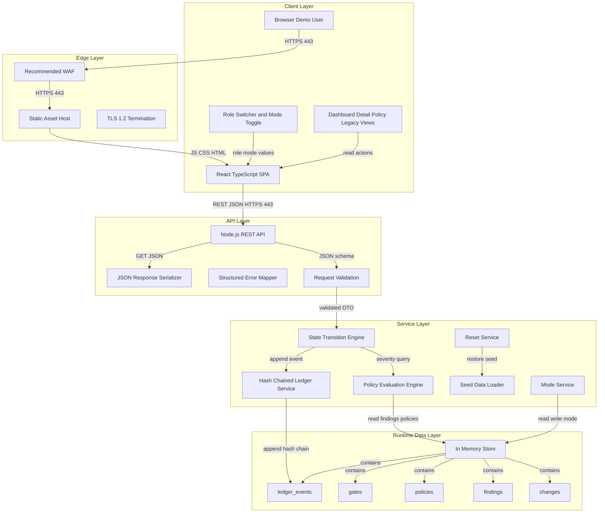
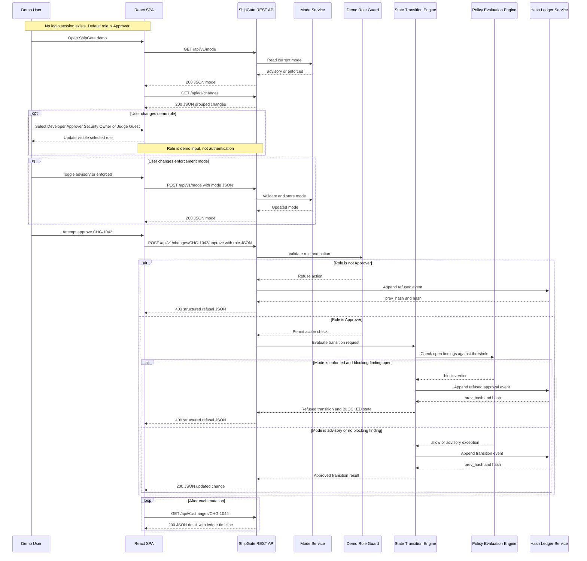
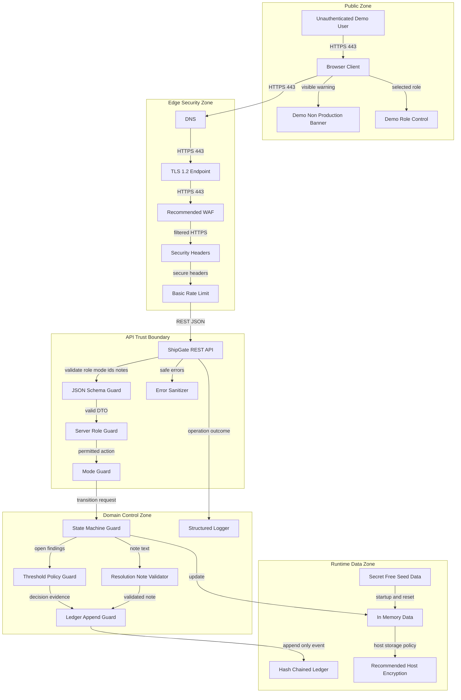
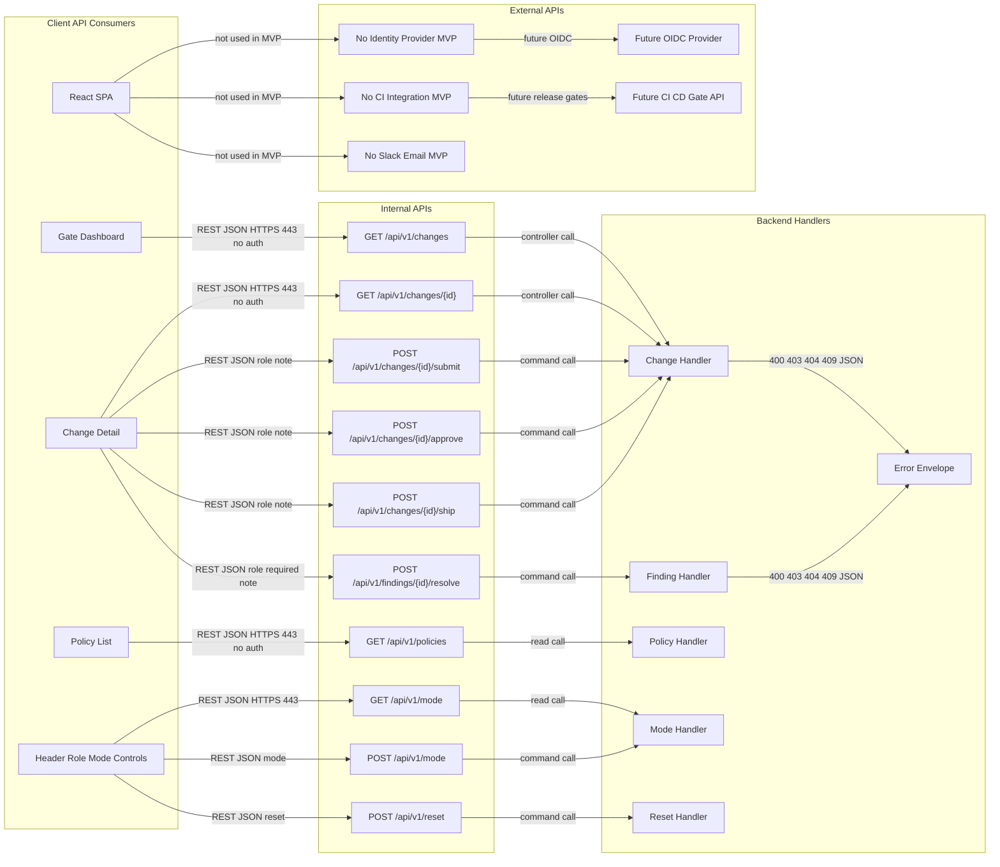
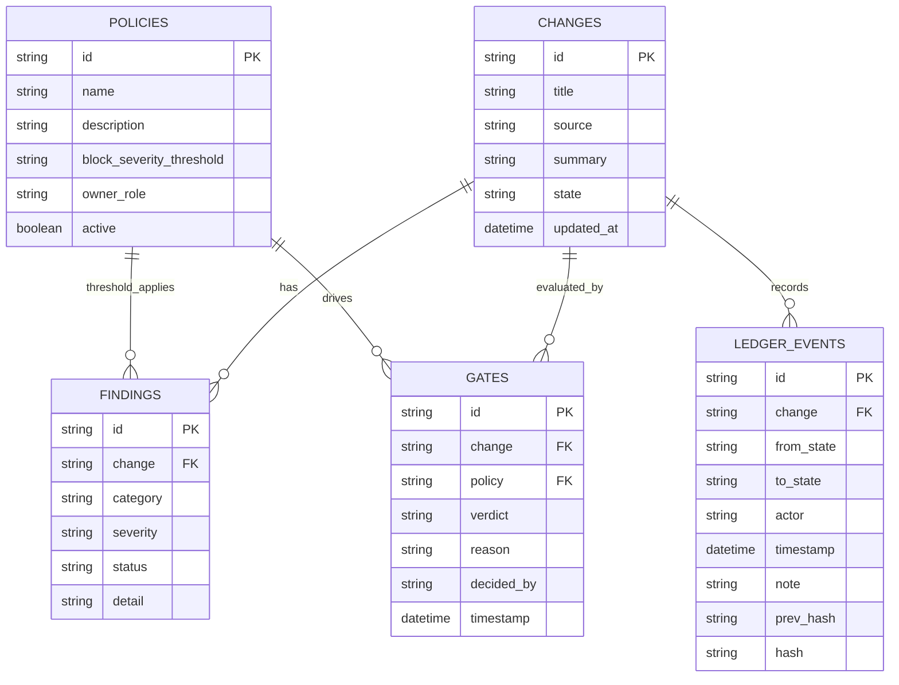

## Architecture Executive Summary

### Project Context
ShipGate is a greenfield release-governance web application for replacing email-and-meeting-based change advisory board behavior with deterministic, transparent, and auditable gate decisions. The MVP serves Developers, Approvers, Security Owners, Judge or Guest evaluators, Product Sponsors, Compliance Reviewers, and the Engineering Team. The product must demonstrate that critical release findings cannot be rubber-stamped as informational when enforced mode is active, while still allowing a clearly labeled advisory mode to illustrate the legacy baseline.

The proposed architecture is a TypeScript modular monolith: a React single page application calls a lightweight Node.js REST API, and the backend process owns all mutable state, policy evaluation, state transitions, reset behavior, mode management, and hash-chained ledger updates. Runtime state is intentionally in memory for the demo release. The design optimizes for deterministic repeatability, low operational overhead, and strong separation between presentation and governance decisions.

### Architectural Philosophy
1. **Backend-owned governance decisions.** The frontend may display role-specific affordances, but it cannot approve, ship, resolve, reset, evaluate policies, or mutate ledger state directly. This protects the primary business outcome: 100 percent refusal of enforced-mode approval or shipment attempts with open high or critical findings.
2. **Demo simplicity with explicit boundaries.** The MVP is unauthenticated, in-memory, and non-production by design. Every screen must label role switching and mode switching as demo controls so evaluators do not mistake the MVP for production identity assurance.
3. **Evidence-first user experience.** The dashboard groups changes by allow and block verdict, and the detail screen co-locates findings, policy evaluation, gate verdict, and ledger timeline so evaluators can identify why CHG-1042 is blocked within 60 seconds.
4. **Append-only decision evidence.** Every successful and refused transition appends a hash-linked ledger event. If ledger recording fails, the system must not claim that the decision is verified.
5. **Small now, extensible later.** The MVP avoids durable persistence, real authentication, external CI or change-management integrations, notifications, and analytics, but it uses clean module boundaries so future productionization can add persistent storage, real RBAC, external pipeline integrations, and retention automation without rewriting the domain model.

### Intent Alignment
- The **React SPA** enables the Gate Dashboard, Change Detail, Policy List, Legacy View, Role Switcher, responsive design, and fast unauthenticated demo access.
- The **Node.js REST API** enables synchronous request and refresh behavior after each state-changing action.
- The **State Transition Engine** enforces DRAFT to IN_REVIEW to BLOCKED to RESOLVED to APPROVED to SHIPPED rules, including refusal behavior.
- The **Policy Evaluation Engine** implements the seeded policy named `Secrets must not ship` with high-and-above blocking semantics.
- The **Hash-Chained Ledger** provides SOC 2-oriented evidence for actor role, state movement, timestamp, note, reason, and previous-link integrity.
- The **Seed Data Loader and Reset Endpoint** ensure repeated demos restore CHG-1041 through CHG-1048 and return mode to advisory.

### Architecture Decision Records
| Decision | Choice | Alternatives Considered | Rationale | Trade-offs |
|---|---|---|---|---|
| Application style | TypeScript modular monolith with React SPA and Node.js REST backend | Microservices: good isolation but excessive deployment complexity for 8 seeded changes. Full-stack server-rendered app: simpler hosting but risks mixing UI and transition ownership. | The MVP needs clear backend ownership without distributed-system overhead. A modular monolith gives testable boundaries for state engine, policy evaluator, ledger, seed data, and REST controllers. | Lower independent scalability than microservices; future production integrations may require extraction of services. |
| Backend framework | Fastify or similarly lightweight Node.js framework with TypeScript strict mode | Express: familiar but weaker built-in schema validation. Next.js API routes: convenient but couples frontend deployment to domain API. | A lightweight framework with JSON schema validation, typed handlers, and high request throughput fits synchronous REST and strict input validation. | Slightly more setup than minimal Express; team must follow dependency injection boundaries to avoid handler logic bloat. |
| State persistence | Single backend process with in-memory store seeded on startup | PostgreSQL: durable but outside MVP. Browser local state: fast but violates backend-owned enforcement. | The decision anchors require in-memory runtime state and reset to deterministic seed data. This keeps the demo repeatable and avoids production persistence claims. | State is lost on process restart; no multi-instance writes; not suitable for production audit retention. |
| Client server synchronization | Synchronous REST only with re-fetch after actions | WebSockets or SSE: real-time but unnecessary for 25 users. GraphQL: flexible but adds schema complexity. | Requirements explicitly prefer synchronous REST and client refresh after actions. This is easiest to test and reason about for deterministic demo flows. | No push updates; concurrent users may need manual refresh for the latest state. |
| Authorization model | Demo role sent as request context and enforced server-side | Real OAuth or OIDC: production-grade but out of scope. UI-only role hiding: simple but bypassable. | The MVP must be usable without login while still preventing invalid state-changing actions by selected demo role. Server-side role checks maintain the enforcement story. | Actor identity is a selected role, not a verified person; audit evidence is demo evidence only. |
| Gate policy model | Threshold-based severity evaluator with high-and-above block threshold | Hard-coded CHG-1042 check: fastest but unmaintainable. General policy authoring: powerful but out of scope. | Threshold-based gates match release-governance best practice and support all seeded findings without premature policy CRUD. | Limited to predefined seeded policy taxonomy in MVP. |
| Audit model | Hash-chained append-only in-app ledger | Plain activity log: easier but not tamper-evident. Durable immutable storage: stronger but out of scope. | Hash chaining provides visible integrity linkage while staying within in-memory MVP constraints. | Not legally durable after reset or restart; future production requires write-once storage and retention automation. |
| Deployment path | Forge Shipping pipeline with Node build, Docker image, security scans, registry push, gated deploy, and post-deploy tests | Manual deploy: low setup but poor repeatability. Full GitOps platform from day one: strong controls but heavier operations. | The user selected Forge Shipping and policies require supply-chain scanning, artifact integrity, and gated promotion. | Adds CI configuration work even for demo; production-grade observability remains intentionally limited for MVP. |

---

## System Architecture Overview

### Layered Design
The proposed ShipGate architecture separates presentation, API boundary, domain services, and runtime state. The React SPA is responsible for responsive rendering, navigation, local selected demo role, visible selected mode, and user feedback. It does not own authoritative change state, finding status, policy verdicts, gate decisions, or ledger entries. All reads and mutations cross the REST boundary to the Node.js API.

The API layer exposes versioned endpoints under `/api/v1`. Controllers perform request validation, map domain failures to proper HTTP status codes, and return structured error responses. They delegate all governance decisions to domain services. This separation is important because the core risk is frontend bypass: if a user can directly mutate state in the browser, the product fails its core claim that blocking findings cannot be overridden incorrectly.

The service layer is intentionally explicit. `StateTransitionEngine` owns allowed transitions and role checks. `PolicyEvaluationEngine` owns severity threshold decisions. `HashLedgerService` appends success and refusal evidence. `SeedDataLoader` creates deterministic data, and `ResetService` restores the original seeded dataset plus advisory mode. These services share TypeScript domain types so transition rules are testable without HTTP or UI dependencies.

The data layer is an in-memory store inside the single backend process. This is the right MVP choice because the demo must be repeatable, lightweight, and explicitly non-production. The trade-off is that the application must not make production retention claims. For future productionization, this data layer can be replaced by PostgreSQL plus immutable object storage or append-only event storage while preserving service interfaces.

### Key Runtime Targets
| Target | Value | Reason |
|---|---:|---|
| Initial dashboard interactive time | Under 2 seconds | Supports frictionless judging and pilot demos |
| Core action feedback | p95 under 500 milliseconds | Keeps approval and refusal flows fast |
| Reset duration | Under 1 second | Enables repeated live demos |
| Pilot concurrency | 25 concurrent users | Matches MVP non-functional requirement |
| API timeout budget | 3 seconds per request | Prevents hanging demo interactions |
| Ledger visibility | Within 1 second of action completion | Supports audit completeness success metric |

---

## Data Flow Diagram

### Decision Flow
ShipGate has two primary data flows: read-oriented evidence presentation and write-oriented governance actions. Read flows begin when a user opens the dashboard, policy list, legacy view, or change detail screen. The SPA requests JSON from the API, the API reads the in-memory store, the policy evaluator derives gate verdicts from current findings and active policies, and the response returns grouped changes, detail panels, policy metadata, and ledger timelines.

Write flows begin with explicit user actions: submit change, approve change, resolve finding, ship change, switch mode, or reset. Each request includes an allow-listed role, mode where applicable, resource identifier, and optional note. The backend validates all inputs before invoking the transition engine. If the action is permitted and the state transition is valid, the engine updates the in-memory entity and appends a ledger event. If the transition is refused, such as an enforced-mode approval attempt for CHG-1042 with an open critical secret-handling finding, the backend still appends a refusal ledger event and returns a structured refusal response.

The most important data-flow constraint is atomicity at domain level: a transition must not be visible as successful unless ledger recording also succeeds. Because the MVP uses a single process and in-memory store, this can be implemented as a synchronous critical section around state mutation plus ledger append. For a 25-user pilot this is sufficient and avoids database transactions. Future productionization should replace this with a durable transaction boundary and optimistic concurrency controls.

### Data Handling Rules
| Data | Classification | Flow Control |
|---|---|---|
| Seeded changes and findings | Internal demo data | Never include real PII or secrets |
| Demo role and mode | Internal demo control data | Allow-list validate on every request |
| Resolution notes | Internal demo evidence | Trim, validate non-empty when required, safely render |
| Ledger events | SOC 2-oriented demo evidence | Append-only hash chain in memory |
| Legacy view content | Internal demo narrative | Static content, not a real approval source |

```mermaid
flowchart LR
  subgraph inputLayer["Input Sources"]
    userAction["User Action"]
    pageLoad["Page Load"]
    roleValue["Selected Demo Role"]
    modeValue["Selected Mode"]
    noteValue["Resolution Note"]
    resetClick["Reset Command"]
  end
  subgraph apiProcessing["API Processing"]
    restEndpoint["REST Endpoint"]
    allowListValidation["Allow List Validation"]
    roleCheck["Server Side Role Check"]
    stateCheck["State Machine Check"]
    modeCheck["Advisory Enforced Check"]
  end
  subgraph domainProcessing["Domain Processing"]
    severityCompare["Severity Threshold Compare"]
    verdictDecision["Gate Verdict Decision"]
    mutationPlanner["Transition Mutation Planner"]
    ledgerAppend["Hash Ledger Append"]
    seedRestore["Seed Restore"]
  end
  subgraph storageLayer["In Memory Storage"]
    changeStore["changes Map"]
    findingStore["findings Map"]
    policyStore["policies Map"]
    gateStore["gates Map"]
    ledgerStore["ledger_events Array"]
    modeStore["mode Value"]
  end
  subgraph outputLayer["Output Channels"]
    dashboardJson["Dashboard JSON"]
    detailJson["Change Detail JSON"]
    policyJson["Policy List JSON"]
    ledgerJson["Ledger Timeline JSON"]
    errorJson["Structured Error JSON"]
  end
  pageLoad -->|"GET JSON"| restEndpoint
  userAction -->|"POST JSON"| restEndpoint
  roleValue -->|"role string"| allowListValidation
  modeValue -->|"mode string"| allowListValidation
  noteValue -->|"UTF 8 text"| allowListValidation
  resetClick -->|"POST empty JSON"| restEndpoint
  restEndpoint -->|"DTO"| allowListValidation
  allowListValidation -->|"valid request"| roleCheck
  allowListValidation -->|"400 invalid input"| errorJson
  roleCheck -->|"permitted actor"| stateCheck
  roleCheck -->|"403 demo role refused"| ledgerAppend
  stateCheck -->|"candidate transition"| modeCheck
  modeCheck -->|"findings policies"| severityCompare
  severityCompare -->|"allow block"| verdictDecision
  verdictDecision -->|"success or refusal"| mutationPlanner
  mutationPlanner -->|"entity update"| changeStore
  mutationPlanner -->|"finding update"| findingStore
  mutationPlanner -->|"gate update"| gateStore
  mutationPlanner -->|"event payload"| ledgerAppend
  ledgerAppend -->|"prev_hash hash"| ledgerStore
  seedRestore -->|"restore maps"| changeStore
  seedRestore -->|"restore maps"| findingStore
  seedRestore -->|"restore maps"| policyStore
  seedRestore -->|"restore array"| ledgerStore
  seedRestore -->|"set advisory"| modeStore
  changeStore -->|"JSON view model"| dashboardJson
  findingStore -->|"JSON view model"| detailJson
  policyStore -->|"JSON view model"| policyJson
  ledgerStore -->|"JSON timeline"| ledgerJson
```

---

## Authentication & Authorization Flow

### Demo Access Model
ShipGate MVP deliberately has no real authentication lifecycle. There are no accounts, passwords, sessions, MFA flows, OAuth redirects, JWTs, or refresh tokens. This is not an omission; it is an explicit product constraint that preserves frictionless demo access. However, absence of authentication does not mean absence of authorization-like enforcement. The selected demo role is treated as untrusted request input, validated against an allow-list, and checked server-side for every state-changing action.

The sequence uses the term authorization in the limited MVP sense of **demo action permission**, not verified user identity. The default role is Approver on first load. Users may switch to Developer, Approver, Security Owner, or Judge Guest in the header. The UI may hide or disable unavailable actions for usability, but the backend remains authoritative. A Judge Guest request to approve, ship, submit, resolve, reset, or change state must be refused even if a user crafts a direct REST call.

Mode is also backend-owned. The client can call `GET /api/v1/mode` to read advisory or enforced, and `POST /api/v1/mode` to change it. Advisory mode allows approval and shipment despite open blocking findings, but ledger text must clearly record the exception. Enforced mode refuses approval or shipment when any open finding meets or exceeds the active policy threshold. A reset returns mode to advisory.

### Security Boundaries
| Boundary | Control |
|---|---|
| Browser to API | HTTPS, JSON schema validation, allow-listed role and mode values |
| UI affordance to backend enforcement | UI guidance plus server-side role checks |
| Advisory to enforced behavior | Backend mode service controls final transition behavior |
| Refused action | No successful transition, but ledger refusal event is appended |
| Demo identity | Actor is selected role only, clearly labeled non-production |

---

## Security Architecture

### Defense in Depth for a Demo Product
ShipGate MVP is intentionally unauthenticated and in-memory, but it still needs a disciplined security architecture because the product’s value proposition is trust in governance decisions. The first security boundary is public web access over TLS 1.2 or higher. A WAF and security headers are recommended for public hosting even for the demo because all screens are reachable without login. The second boundary is the REST API, where every input is untrusted: role, mode, change ID, finding ID, action, and note must be allow-list validated. The third boundary is the domain layer, where role checks, mode checks, state checks, policy checks, and ledger append must happen server-side.

Because no durable persistence exists, encryption at rest is not a meaningful MVP implementation control for application data. However, if the container or host writes process dumps, logs, or build artifacts, those storage locations should be encrypted by the hosting platform. The design must never seed actual credentials, despite the CHG-1042 finding text referring to a detected live credential. Logs should be structured and should include operation, selected demo actor role, resource ID, and outcome, but must not include raw resolution notes if they could contain sensitive text.

The largest security risk is misinterpretation: users may mistake the role switcher for real authentication or in-memory ledger for production-grade audit retention. The mitigations are product-level and architectural: label all screens as demo and non-production, document actor identity as selected role only, and isolate future production requirements such as OIDC, durable append-only storage, tamper-proof log retention, and automated alerting as out of scope for the MVP.

### Security Decisions
| Area | MVP Control | Future Production Control |
|---|---|---|
| Identity | No login, selected demo role | OIDC with PKCE and real RBAC |
| Authorization | Server-side demo role guard | Policy-backed RBAC and audit identity |
| Input safety | Allow-list validation and safe rendering | Same plus centralized schema governance |
| Audit | In-app hash-chained ledger | Durable append-only store and 1 year retention |
| Secrets | No real secrets in seed or logs | Managed secrets with 90 day rotation |
| Network | HTTPS and recommended WAF | VPC segmentation and private service endpoints |

---

## Deployment Architecture

### CI CD Strategy
The deployment architecture uses Forge Shipping as the selected shipping platform. Even though ShipGate MVP is a lightweight demo, the supply-chain controls are not optional: the policies require component tracking, automated SCA, integrity checks, and separation of duty for production promotion. The proposed pipeline is intentionally stronger than the runtime persistence model because build and deployment controls are cheap to automate and reduce demo risk.

The source stage triggers on pull request, commit, and release tag. The build stage runs `build:node` for TypeScript compilation, linting, and unit tests, then `build:docker` for an immutable container image that hosts the Node API and serves the built React assets. Security scans run in parallel and merge into a single security gate: `scan:sonarqube` for code quality, `scan:snyk` for dependency SCA, `scan:gitleaks` for accidental secrets, `scan:semgrep` for static application security checks, and `scan:grype` for container vulnerabilities.

Because no cloud provider preference was specified, Amazon ECR and ECS are selected as concrete, low-friction defaults for the demo. ECS fits a single-container modular monolith without Kubernetes operational overhead. The promotion path deploys to dev, runs smoke and API tests, deploys to staging, runs acceptance tests including CHG-1042 enforced-mode refusal and reset reliability, then requires a manual approval gate before production demo availability. Post-deploy tests validate p95 action feedback under 500 milliseconds for seeded flows, reset under 1 second, and no critical accessibility issues.

### Release Gates
| Gate | Pass Criteria |
|---|---|
| Build quality | TypeScript compile, lint, unit tests, and component tests pass |
| Security scans | No critical dependency, secret, or container findings |
| Acceptance | 100 percent blocking accuracy for open high or critical findings |
| Accessibility | Zero critical WCAG 2.1 AA violations before demo sign-off |
| Manual approval | Product Sponsor or delegate approves production demo promotion |

```mermaid
flowchart LR
  subgraph sourceStage["Source"]
    prTrigger["VCS Pull Request"]
    commitTrigger["VCS Commit"]
    tagTrigger["VCS Release Tag"]
    sourceMerge["Source Revision"]
  end
  subgraph buildStage["Build"]
    nodeBuild["build:node"]
    unitTests["test:generic Unit Tests"]
    dockerBuild["build:docker"]
    imageArtifact["Container Image Artifact"]
  end
  subgraph scanStage["Security Scan"]
    sonarScan["scan:sonarqube"]
    snykScan["scan:snyk"]
    gitleaksScan["scan:gitleaks"]
    semgrepScan["scan:semgrep"]
    grypeScan["scan:grype"]
    scanMerge["Security Scan Merge"]
  end
  subgraph pushStage["Push"]
    signArtifact["Artifact Signature"]
    pushRegistry["push:ecr"]
    registryImage["ECR ShipGate Image"]
  end
  subgraph deployStage["Deploy"]
    deployDev["deploy:awsEcs Dev"]
    testDev["test:generic Dev Smoke"]
    deployStaging["deploy:awsEcs Staging"]
    testStaging["test:accelq Acceptance"]
    approvalGate["Manual Approval Gate"]
    deployProd["deploy:awsEcs Prod Demo"]
  end
  subgraph verifyStage["Test"]
    speedTest["test:speedscale API Replay"]
    smokeProd["test:generic Prod Smoke"]
    accessibilityTest["test:generic WCAG Checks"]
    releaseReport["Release Evidence Report"]
  end
  prTrigger -->|"PR event"| sourceMerge
  commitTrigger -->|"main commit"| sourceMerge
  tagTrigger -->|"release tag"| sourceMerge
  sourceMerge -->|"TypeScript source"| nodeBuild
  nodeBuild -->|"compiled assets"| unitTests
  unitTests -->|"test pass"| dockerBuild
  dockerBuild -->|"OCI image"| imageArtifact
  imageArtifact -->|"source and image"| sonarScan
  imageArtifact -->|"package manifest"| snykScan
  imageArtifact -->|"repository content"| gitleaksScan
  imageArtifact -->|"source rules"| semgrepScan
  imageArtifact -->|"container layers"| grypeScan
  sonarScan -->|"scan result"| scanMerge
  snykScan -->|"scan result"| scanMerge
  gitleaksScan -->|"scan result"| scanMerge
  semgrepScan -->|"scan result"| scanMerge
  grypeScan -->|"scan result"| scanMerge
  scanMerge -->|"all gates pass"| signArtifact
  signArtifact -->|"signed digest"| pushRegistry
  pushRegistry -->|"image push"| registryImage
  registryImage -->|"image digest"| deployDev
  deployDev -->|"HTTPS smoke"| testDev
  testDev -->|"promote digest"| deployStaging
  deployStaging -->|"acceptance run"| testStaging
  testStaging -->|"P0 pass"| approvalGate
  approvalGate -->|"approved release"| deployProd
  deployProd -->|"live endpoint"| speedTest
  deployProd -->|"HTTPS 443"| smokeProd
  deployProd -->|"browser checks"| accessibilityTest
  speedTest -->|"latency report"| releaseReport
  smokeProd -->|"availability report"| releaseReport
  accessibilityTest -->|"WCAG report"| releaseReport
```

---

## Component Architecture

### Component Boundaries
The proposed component architecture is organized around business responsibility rather than technical convenience. The frontend has route-level views and reusable display components. `GateDashboardView` owns grouped queue presentation. `ChangeDetailView` composes the findings list, policy evaluation panel, gate verdict panel, and ledger timeline. `PolicyListView` lists active policies. `LegacyView` is intentionally distinct and static enough to communicate the broken email-and-meeting process. `AppHeader` owns visible role and mode controls, but only as UI controls; authoritative mode lives on the backend.

The backend is split into controller, application, domain, and repository-like in-memory modules. Controllers validate HTTP input and return consistent JSON. Application services orchestrate use cases such as approve change, resolve finding, ship change, submit change, reset demo, and set mode. Domain services implement pure rules: state transition matrix, severity rank comparison, policy evaluation, ledger event hashing, and seed construction. The `InMemoryShipGateStore` is injected behind an interface so the same domain services can be tested without HTTP and later backed by durable storage.

Shared TypeScript contracts are valuable for this product because all entity fields and enumerations are tightly specified: severities, statuses, categories, verdicts, role values, mode values, and state values. However, shared types must not become shared mutable state. The frontend can import types and API clients, but it must not import store or domain mutation functions. This prevents accidental bypass and keeps the design honest.

### Coupling Rules
| Rule | Rationale |
|---|---|
| Views depend on API client and shared types only | Prevents frontend state mutation |
| Controllers depend on application services | Keeps HTTP concerns separate from business rules |
| Application services depend on domain services and store interface | Enables unit tests and future persistence swap |
| Ledger service is called within every transition path | Ensures success and refusal evidence completeness |
| Seed loader is the only component that creates initial dataset | Keeps reset deterministic |

```mermaid
flowchart TD
  subgraph frontendDomain["Frontend Components"]
    appShell["App Shell"]
    appHeader["AppHeader Role Mode Controls"]
    dashboardView["GateDashboardView"]
    detailView["ChangeDetailView"]
    policyListView["PolicyListView"]
    legacyView["LegacyView"]
    severityBadge["SeverityBadge"]
    ledgerTimeline["LedgerTimeline"]
    apiClient["ShipGateApiClient"]
  end
  subgraph sharedDomain["Shared Contracts"]
    domainTypes["Domain TypeScript Types"]
    apiSchemas["API Request Response Schemas"]
    enumValues["Role Mode Severity State Enums"]
  end
  subgraph apiDomain["Backend API Modules"]
    changeController["ChangeController"]
    findingController["FindingController"]
    policyController["PolicyController"]
    modeController["ModeController"]
    resetController["ResetController"]
    errorHandler["ErrorHandler"]
  end
  subgraph serviceDomain["Backend Services"]
    transitionService["StateTransitionEngine"]
    policyService["PolicyEvaluationEngine"]
    ledgerService["HashLedgerService"]
    seedService["SeedDataLoader"]
    resetService["ResetService"]
    modeService["ModeService"]
  end
  subgraph storeDomain["Storage Adapter"]
    storeInterface["ShipGateStore Interface"]
    memoryAdapter["InMemoryShipGateStore"]
    cryptoHasher["SHA256 Hash Provider"]
  end
  appShell -->|"direct import"| appHeader
  appShell -->|"route render"| dashboardView
  appShell -->|"route render"| detailView
  appShell -->|"route render"| policyListView
  appShell -->|"route render"| legacyView
  dashboardView -->|"REST calls"| apiClient
  detailView -->|"REST calls"| apiClient
  policyListView -->|"REST calls"| apiClient
  appHeader -->|"GET POST mode"| apiClient
  detailView -->|"direct import"| severityBadge
  detailView -->|"direct import"| ledgerTimeline
  apiClient -->|"shared DTOs"| apiSchemas
  apiSchemas -->|"shared enums"| enumValues
  changeController -->|"use case call"| transitionService
  findingController -->|"use case call"| transitionService
  policyController -->|"read call"| policyService
  modeController -->|"use case call"| modeService
  resetController -->|"use case call"| resetService
  changeController -->|"errors"| errorHandler
  transitionService -->|"evaluate"| policyService
  transitionService -->|"append"| ledgerService
  resetService -->|"restore"| seedService
  transitionService -->|"repository interface"| storeInterface
  policyService -->|"repository interface"| storeInterface
  ledgerService -->|"repository interface"| storeInterface
  ledgerService -->|"SHA256"| cryptoHasher
  modeService -->|"repository interface"| storeInterface
  storeInterface -->|"implemented by"| memoryAdapter
  seedService -->|"seed maps"| memoryAdapter
```

---

## API Integration Architecture

### REST API Boundary
ShipGate’s integration architecture is intentionally small and internal. The React SPA is the only MVP client. There are no external CI CD, ServiceNow, Slack, email, identity provider, or notification integrations in scope. This reduces scope while preserving the architectural seam for future integrations. The API should be versioned under `/api/v1` and return consistent JSON envelopes for success and error cases.

The key design choice is to model actions as command endpoints rather than generic CRUD. The MVP does not support arbitrary creation or editing of changes, findings, policies, or ledger events. It supports defined governance flows: submit, approve, ship, resolve finding, reset, get or set mode, list changes, inspect a change, list policies, and read ledger evidence. This command-style REST design maps directly to acceptance criteria and avoids accidental expansion into admin CRUD.

Each state-changing endpoint includes selected demo role in the request body or a dedicated request header such as `X-ShipGate-Demo-Role`. The backend must treat it as untrusted and validate it. For clarity and auditability, request bodies should include optional `note` only where the action supports evidence, and resolution notes must be non-empty after trimming. Responses should include the updated change view model, gate verdict, ledger event reference, and human-readable reason. Refusals should use HTTP 403 for disallowed role, 400 for invalid input, 404 for unknown resources, and 409 for policy or state conflict.

### Endpoint Groups
| Endpoint | Method | Purpose | Key Response Target |
|---|---|---|---|
| `/api/v1/changes` | GET | Dashboard list grouped by verdict | Under 500 ms p95 |
| `/api/v1/changes/{id}` | GET | Detail data for findings, policy evaluation, gate, ledger | Under 500 ms p95 |
| `/api/v1/changes/{id}/submit` | POST | Developer submits DRAFT to IN_REVIEW | Ledger event included |
| `/api/v1/changes/{id}/approve` | POST | Approver approves or is refused | Success or refusal event |
| `/api/v1/changes/{id}/ship` | POST | Approver ships or is refused | Success or refusal event |
| `/api/v1/findings/{id}/resolve` | POST | Security Owner resolves with note | Ledger event included |
| `/api/v1/policies` | GET | Active policy list | Seed policy visible |
| `/api/v1/mode` | GET POST | Read or set advisory or enforced mode | Mode state returned |
| `/api/v1/reset` | POST | Restore seed data and advisory mode | Full reset confirmation |

---

## Database Schema Analysis

### Logical Schema for In-Memory MVP
ShipGate MVP has no durable database, but it still needs a formal logical schema so entities, invariants, API contracts, seed data, tests, and future persistence remain consistent. The schema has five required entities: `changes`, `findings`, `policies`, `gates`, and `ledger_events`. The in-memory implementation should represent these as typed maps or arrays, but the relationships should be modeled as if they were database tables.

A `Change` is the aggregate root for governance state. It has stable IDs from CHG-1041 through CHG-1048 and stores title, source, summary, and state. `Finding` belongs to one change and carries category, severity, status, and detail. `Policy` defines active blocking behavior. The seeded policy is `Secrets must not ship`, owned by Security Owner, with high-and-above threshold. `Gate` records the latest evaluation for a change and policy. `LedgerEvent` records successful and refused transitions, with `prev_hash` linking events into a tamper-evident sequence. The requirements list exact ledger fields and do not explicitly list `hash` or `reason`, but the architecture should include computed `hash` internally and reason in the event payload or note metadata to support verification and refusal explainability.

### Data Integrity Rules
| Rule | Enforcement Location |
|---|---|
| Change IDs are stable and seeded | SeedDataLoader tests |
| Severity values are exactly info, low, medium, high, critical | Shared enum and schema validation |
| Finding categories are exactly the six specified categories | Shared enum and schema validation |
| Finding status values are exactly open or resolved | Shared enum and schema validation |
| Gate verdict values are exactly allow or block | PolicyEvaluationEngine |
| Ledger append is required for every successful and refused transition | StateTransitionEngine and HashLedgerService |
| Reset restores original data and advisory mode | ResetService integration tests |

### Future Persistence Note
For production, this ER model can map directly to PostgreSQL tables with foreign keys and an append-only ledger table. Production ledger retention would require immutable storage controls and automated retention policy enforcement, which are intentionally out of scope for this MVP.

---

## Technology Stack Summary

### Stack Selection
The technology stack is optimized for a greenfield demo product that must be fast to build, easy to test, and honest about its non-production persistence model. TypeScript across frontend and backend reduces schema drift for strict enumerations such as severity, role, mode, category, finding status, verdict, and change state. React is the right frontend choice because the product is interaction-heavy, has multiple responsive screens, and benefits from componentized severity badges, cards, timelines, and header controls.

A lightweight Node.js REST backend, preferably Fastify with TypeScript strict mode, is recommended because it provides a small operational footprint, strong JSON schema validation, and clear separation between controllers and domain services. Express remains acceptable if the team adds validation and disciplined service boundaries, but Fastify better matches the validation-heavy API contract. For the UI component system, Tailwind CSS plus an accessible component library such as Radix UI or shadcn style primitives is recommended to support fast modern layouts while preserving keyboard navigation and semantic controls.

No durable database is selected for the MVP. The data store is an injected in-memory adapter seeded on startup. This is acceptable only because the application is explicitly a demo. The architecture should still model entities and relationships with database discipline so PostgreSQL and immutable ledger storage can be introduced in future phases.

| Layer | Technology | Version | Status | Rationale |
|---|---|---|---|---|
| Frontend language | TypeScript | 5.x | modern | Strict typing supports exact enums, null handling, and shared request response contracts. |
| Frontend framework | React | 18.x or 19.x stable | modern | Component model fits dashboard cards, detail panels, role controls, and responsive routes. |
| Frontend build | Vite | 6.x or current stable | modern | Fast local builds and small production bundles for a SPA demo. |
| UI styling | Tailwind CSS | 4.x or current stable | modern | Utility classes support responsive 375 px to 1280 px layouts and consistent severity colors. |
| Accessible primitives | Radix UI or equivalent | Current stable | modern | Helps meet keyboard, focus, dialog, select, and screen reader requirements. |
| Backend runtime | Node.js LTS | 22 LTS | modern | Stable LTS runtime for TypeScript REST API and single-process in-memory state. |
| Backend framework | Fastify | 5.x | modern | Lightweight, schema-oriented, high-throughput REST implementation. |
| API style | REST JSON | v1 endpoints | acceptable | Best fit for synchronous request and re-fetch behavior. |
| Runtime state | In-memory store | Process local | acceptable | Required for MVP demo, but not suitable for durable production retention. |
| Hashing | SHA-256 crypto provider | Runtime built in | acceptable | Adequate for hash-chain integrity demonstration when used without hardcoded secrets. |
| Testing | Vitest and Playwright | Current stable | modern | Unit tests for domain rules and end-to-end tests for CHG-1042, reset, and accessibility flows. |
| Containerization | Docker OCI image | Current stable | modern | Enables repeatable Forge Shipping build, scan, push, and deploy. |
| Deployment runtime | AWS ECS Fargate | Current managed platform | acceptable | Concrete low-operations target for single-container demo deployment. |
| CI CD | Forge Shipping | Selected platform | modern | Supports build, scan, push, deploy, test, and gate steps required by decision anchors. |
| Observability | Structured console logs plus hosting metrics | MVP basic | acceptable | Fits in-app ledger-only MVP while leaving production SIEM retention out of scope. |

---

## Architectural Concerns & Recommendations

### Key Concerns
ShipGate’s primary architectural risks come from the intentional tension between demo simplicity and governance credibility. The MVP avoids login, durable storage, external integrations, and operational log retention, yet it must still demonstrate deterministic enforcement and SOC 2-oriented evidence. The architecture therefore needs very clear guardrails: no direct frontend mutation, no ambiguous role labeling, no real secrets in seed data, and no claim that the in-memory ledger is durable production audit evidence.

The most critical recommendation is to test negative paths as first-class behavior. Approval and shipment refusals are not error cases in the business sense; they are the core proof that ShipGate works. Acceptance tests should assert that CHG-1042 in enforced mode cannot be approved or shipped while its critical finding is open, that the attempted action is recorded in the ledger, and that the user sees a clear reason. Tests should also assert advisory mode behavior so evaluators can compare baseline legacy behavior to enforced governance.

| # | Concern | Severity | Impact | Recommendation | Effort |
|---:|---|---|---|---|---|
| 1 | Frontend bypass of governance rules | Critical | Invalid direct state mutation would undermine the primary value proposition. | Keep all transition logic in backend services; expose only command endpoints; write contract tests proving UI cannot mutate authoritative state. | M |
| 2 | Role switcher mistaken for real authentication | High | Stakeholders may overestimate production security maturity. | Display demo and non-production labels in header and transition dialogs; document selected role as actor label only. | S |
| 3 | In-memory ledger mistaken for durable SOC 2 evidence | High | Compliance reviewers may misinterpret retention and tamper resistance. | Label ledger as visible demo evidence; include productionization note for immutable storage and 1 year retention. | S |
| 4 | Ledger append failure after state mutation | Critical | Product could show an unverified transition as valid. | Implement transition plus ledger append as one synchronous domain operation; fail closed if ledger append fails. | M |
| 5 | Advisory mode confusion | Medium | Users may think unsafe shipping is allowed by the target product. | Use distinct warning copy and ledger text such as shipped with open critical finding in advisory mode. | S |
| 6 | Weak input validation for note, role, mode, and IDs | High | XSS, invalid transitions, or inconsistent state could occur. | Use schema validation, allow-listed enums, output encoding, and note length limits such as 1 to 1000 characters. | M |
| 7 | Concurrent demo actions in single process | Medium | Two users may act on the same change and see surprising outcomes. | Serialize mutations in a process-local critical section and return updated state after each mutation. | M |
| 8 | Seed data not broad enough | Medium | Dashboard, policy list, and state-machine flows may not demonstrate value. | Seed clean, low, medium, blocked, resolved, approved, and shipped examples across CHG-1041 to CHG-1048. | S |
| 9 | Accessibility regressions in responsive dashboard | High | Users may be unable to complete core flows and policy conformance fails. | Add keyboard tests, visible focus review, color contrast checks, and severity text plus icon labels. | M |
| 10 | Future persistence swap becomes hard | Medium | Productionization may require rewriting business logic. | Keep store behind interface and test domain services without HTTP or storage implementation. | M |
| 11 | Lack of production observability | Medium | MVP incidents may be hard to debug and production claims are limited. | Use structured logs and health checks for MVP; defer SIEM retention and alerting explicitly. | S |
| 12 | Supply-chain vulnerability in demo dependencies | High | Public demo could ship known vulnerable packages or leaked secrets. | Run SCA, secret scanning, static analysis, and container scanning in Forge Shipping. | M |

---

## Quality Attributes & NFR Matrix

### Quality Attribute Strategy
The MVP quality targets are intentionally concrete because ShipGate must prove value in a timed demo and pilot setting. The most important quality attributes are enforcement correctness, explainability, audit completeness, accessibility, and predictable demo performance. Availability and disaster recovery targets are lighter than production systems because durable persistence and multi-region failover are out of scope for the demo; however, the architecture should not preclude those capabilities later.

Performance is achievable because the dataset is tiny: eight changes, one active policy, and a short ledger. The design should nevertheless keep p95 action feedback under 500 milliseconds and reset under 1 second so the user experience feels credible. API handlers should avoid artificial delays, keep policy evaluation O(number of findings times number of active policies), and return denormalized view models to reduce client computation.

Maintainability depends on clean module boundaries. The transition engine, policy evaluator, ledger service, seed loader, and mode service should have independent unit tests. Acceptance tests should cover at least the twelve user stories, with special emphasis on CHG-1042. Accessibility must be included in the definition of done: keyboard navigation, visible focus, semantic labels, color contrast, and severity conveyed by text and iconography, not color alone.

| Attribute | Target | Current | Gap | Priority |
|---|---|---|---|---|
| Performance response time | Dashboard interactive under 2 seconds; p95 action feedback under 500 milliseconds; reset under 1 second | New project baseline not yet implemented | Need frontend performance budget, API timing tests, and reset benchmark | High |
| Performance throughput | Support 25 concurrent pilot users with seeded dataset and synchronous REST | New project baseline not yet implemented | Need simple load test for list, detail, approve refusal, resolve, ship, reset | Medium |
| Availability uptime SLO | 99.0 percent for demo availability windows; health check endpoint every 30 seconds | New project baseline not yet implemented | Need single-container health check and restart policy | Medium |
| Scalability concurrent users | 25 concurrent pilot users for MVP; future production to revisit persistence and concurrent editing | New project baseline not yet implemented | In-memory single process limits horizontal scaling for mutations | Medium |
| Scalability data volume | 8 seeded changes, expected under 500 ledger events per demo session | New project baseline not yet implemented | Need memory budget and reset behavior tests | Low |
| Security compliance level | SOC 2-oriented demo evidence, no real PII, no real secrets, HTTPS, server-side checks | New project baseline not yet implemented | Need security headers, validation, secret scan, and non-production labeling | High |
| Accessibility | WCAG 2.1 AA, zero critical violations before broader demo availability | New project baseline not yet implemented | Need keyboard, screen reader, focus, and contrast tests | High |
| Maintainability | Domain services unit tested at 90 percent coverage; P0 flows acceptance tested at 100 percent | New project baseline not yet implemented | Need test architecture and CI gating | High |
| Auditability | 100 percent of successful and refused transition attempts create visible ledger entry within 1 second | New project baseline not yet implemented | Need atomic transition plus ledger append tests | Critical |
| Reliability | Reset success 100 percent in acceptance tests; prior visible state preserved if reset fails | New project baseline not yet implemented | Need failure-path tests and structured error responses | High |

---

## Operational Architecture

### MVP Operations
The operational architecture distinguishes between what is implemented for the demo and what is deliberately deferred. For MVP, the authoritative audit experience is the in-app hash-chained ledger, not a production SIEM or retained immutable log platform. Operational logs should still exist for troubleshooting, but the design should explicitly avoid claiming 1-year operational retention or alerting coverage for MVP because the user decision anchors exclude production operational log retention and alerting.

The runtime is a single container hosting the Node.js API and static React assets. A health endpoint should report process readiness, seed state availability, and mode service availability. Because the store is in memory, container restart restores startup seed state; this is acceptable for a demo but must be documented. Reset is the intentional user-facing recovery mechanism and must preserve prior visible state if reset fails. In practice, reset failure should be rare because it only reconstructs a small deterministic object graph.

Metrics should focus on demo health: request counts, p95 latency, structured error counts, reset success count, transition success count, refusal count, and ledger append failures. Alerts for MVP can be lightweight hosting alerts rather than full security operations alerts: container unhealthy for 2 minutes, p95 action feedback above 500 milliseconds for 5 minutes, or any ledger append failure. For production, this would need tamper-proof logs, SIEM integration, alerting for access failures, immutable audit storage, retention automation, and environment isolation.

### Operational Targets
| Area | MVP Target |
|---|---|
| Health check | `/healthz` every 30 seconds, fails if API cannot serve seeded state |
| Readiness | `/readyz` returns ready after seed data loaded |
| Restart behavior | Restore seed data and advisory mode on startup |
| Logging | Structured JSON logs with actor role, resource, operation, outcome, and correlation ID |
| Retention | Hosting default for MVP, production retention explicitly out of scope |
| Alerts | Unhealthy container, elevated error rate above 1 percent, ledger append failure |
| Recovery | User-visible reset plus container restart for demo state recovery |

```mermaid
flowchart TD
  subgraph runtimeOps["Runtime Operations"]
    ecsService["ECS Demo Service"]
    shipgateContainer["ShipGate Container"]
    healthEndpoint["GET /healthz"]
    readyEndpoint["GET /readyz"]
    resetEndpoint["POST /api/v1/reset"]
    restartPolicy["Container Restart Policy"]
  end
  subgraph observabilityOps["Observability"]
    structuredLogs["Structured JSON Logs"]
    hostMetrics["Host Metrics"]
    apiMetrics["API Metrics"]
    latencyMetric["p95 Latency Metric"]
    errorMetric["Error Rate Metric"]
    ledgerMetric["Ledger Append Failure Metric"]
    dashboard["Demo Operations Dashboard"]
  end
  subgraph reliabilityOps["Reliability Controls"]
    seedOnStart["Seed On Startup"]
    atomicMutation["Atomic Mutation Ledger Append"]
    safeErrorState["Safe Error State"]
    emptyState["Actionable Empty State"]
    retryGuidance["User Retry Guidance"]
  end
  subgraph deliveryOps["Delivery Controls"]
    forgePipeline["Forge Shipping Pipeline"]
    securityScans["Parallel Security Scans"]
    acceptanceTests["Acceptance Tests"]
    manualGate["Manual Promotion Gate"]
    releaseEvidence["Release Evidence"]
  end
  ecsService -->|"runs"| shipgateContainer
  shipgateContainer -->|"HTTP 200 or 503"| healthEndpoint
  shipgateContainer -->|"HTTP 200 after seed"| readyEndpoint
  resetEndpoint -->|"restore seed"| seedOnStart
  restartPolicy -->|"process restart"| seedOnStart
  shipgateContainer -->|"JSON lines"| structuredLogs
  ecsService -->|"CPU memory"| hostMetrics
  shipgateContainer -->|"request counts"| apiMetrics
  apiMetrics -->|"p95 under 500 ms"| latencyMetric
  apiMetrics -->|"below 1 percent"| errorMetric
  apiMetrics -->|"zero expected"| ledgerMetric
  structuredLogs -->|"search and view"| dashboard
  hostMetrics -->|"charts"| dashboard
  latencyMetric -->|"charts"| dashboard
  errorMetric -->|"charts"| dashboard
  ledgerMetric -->|"alert trigger"| dashboard
  atomicMutation -->|"failure blocks success"| safeErrorState
  safeErrorState -->|"UI feedback"| emptyState
  emptyState -->|"recovery text"| retryGuidance
  forgePipeline -->|"build release"| securityScans
  securityScans -->|"pass reports"| acceptanceTests
  acceptanceTests -->|"P0 pass"| manualGate
  manualGate -->|"approved"| releaseEvidence
```

---

## Confidence

Overall: **100%**

| Section | Score | Why | How to Improve |
|---------|-------|-----|----------------|
| Intent Alignment | 100% | All 8 intent features covered. | Intent is well-captured. Consider adding comments for priority rankings or phasing details. |
| Policy Compliance | 100% | All 24 policies addressed. | Good policy alignment. Verify any industry-specific regulations are covered. |
| Context Documents | N/A | Not provided — no documents uploaded for this dimension. | Upload the relevant documents to enable this check. |
| Structural Completeness | 100% | All 6 required sections present. | All expected sections are present. Add comments on any section if you want more depth. |

> Strongly aligned with project intent and provided context.